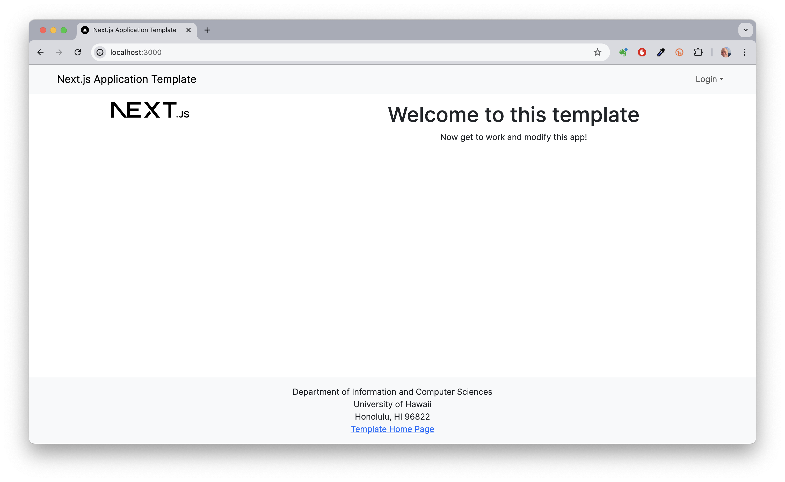

**Digits** is an app designed for users to:

- Create an account.
- Build and manage a list of contacts.
- Add timestamped notes about their interactions with each contact.

**Installation Steps:**

1. **Install Meteor**: Start by installing Meteor on your system.

2. **Download Digits**: Next, obtain a copy of Digits. Since it's a private repository, you'll need to request access from the author.

3. **Install Libraries**: Navigate to the app directory and install the necessary libraries using:

   ```bash
   $ meteor npm install
   ```

4. **Run the Application**: After the libraries are installed, start the app with:

   ```bash
   $ meteor npm run start
   ```

   On the first run, the app will automatically create some default users and data. The output will look like this:

   ```bash
   meteor npm run start

   > meteor-application-template-react@ start /path/to/digits/app
   > meteor --no-release-check --settings ../config/settings.development.json

   => Started proxy.
   => Started MongoDB.
   I20180305-18:06:02.764(-10)? Creating the default user(s)
   I20180305-18:06:02.803(-10)?   Creating user admin@foo.com.
   I20180305-18:06:02.803(-10)?   Creating user john@foo.com.
   I20180305-18:06:02.804(-10)? Creating default contacts.
   I20180305-18:06:02.804(-10)?   Adding: Johnson (john@foo.com)
   I20180305-18:06:02.804(-10)?   Adding: Casanova (john@foo.com)
   I20180305-18:06:02.804(-10)?   Adding: Binsted (admin@foo.com)
   => Started your app.
   => App running at: http://localhost:3000/
   ```

   A note about bcrypt: You'll see a warning indicating you're using a pure JavaScript version, which is slower than the native implementation. For optimal performance, you can run:

   ```bash
   meteor npm install --save bcrypt
   ```

   Installing bcrypt can be tricky on some systems, especially Windows, but it's mainly used for password verification. You can disregard this warning during early development phases.

If everything is set up correctly, you should see the app at http://localhost:3000. Log in with the credentials from `settings.development.json` or create a new account.

Additionally, you can check your code for errors using ESLint with:

```bash
meteor npm run lint
```

**User Interface Overview:**

- **Landing Page**: Upon opening the app, you'll find an introduction to Digits' features.

- **Registration**: If you don’t have an account, click on “Login” and then “Sign Up” to create one.

- **Sign In**: Click on the Login link and then on “Sign In” to access the Sign In page.

- **User Home Page**: After logging in, you'll be directed to your home page, similar to the landing page, but with a navigation bar for listing and adding contacts.

- **List Contacts**: Click “List Contacts” to view all contacts linked to your account. You can also add timestamped notes about your interactions with each contact.

- **Edit Contacts**: From the List Contacts page, select “Edit” next to any contact to modify their information.

- **Admin Mode**: You can designate users as “Admins” in the settings file. Admins gain access to a special link in the NavBar to see all contacts associated with every user.
